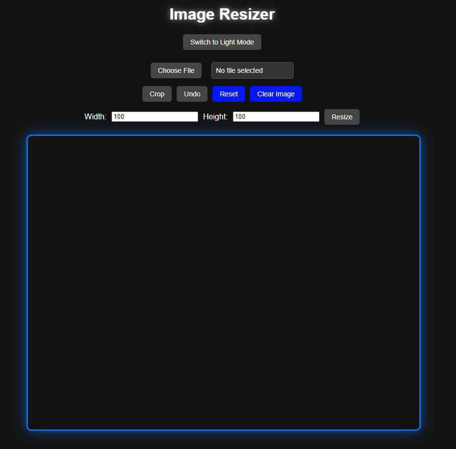

# Image Resizer

A simple, user-friendly web application for resizing, cropping, and managing images directly in the browser. This tool supports basic image editing features like resizing, cropping, undoing changes, resetting the image to its original state, and downloading the modified image.

---

## Features

- Upload Images: Upload and display images on a resizable canvas.
- Resize Images: Modify the image dimensions (width and height) dynamically.
- Crop Images: Select a portion of the image to crop using a draggable selection box.
- Undo Changes: Undo the last canvas operation.
- Reset Image: Reset the canvas to the original uploaded image.
- Clear Canvas: Clear the canvas and reset it to its default dimensions (800x600).
- Download Edited Image: Save the current state of the image as a PNG file.
- Light/Dark Mode: Switch between light and dark themes for a better user experience.

---

## Installation

1. Clone this repository or download the files as a zip.

```
git clone https://github.com/your-username/image-resizer.git
cd image-resizer
```

2. Open the project directory and ensure the following files are present:

- index.html
- styles.css
- main.js

3. Launch the application:

- Open index.html in your browser directly, or
- Use a local web server like Live Server in Visual Studio Code:
  - Right-click index.html > Open with Live Server.

---

## Usage

1. Upload an Image:

   - Click the "Choose File" button and select an image from your computer.
   - The image will be displayed on the canvas.

2. Resize the Image:
   - Enter desired dimensions (width and height) in the respective input fields.
   - Click the Resize button to apply the changes.

3. Crop the Image:
   - Click the Crop button.
   - Drag on the image to select the cropping area.
   - Release the mouse to crop the selected area.

4. Undo Changes:

   - Click the Undo button to revert the last canvas modification.

5. Reset the Image:

   - Click the Reset button to restore the canvas to the original uploaded image.

6. Clear the Canvas:

   - Click the Clear Image button to clear the canvas and reset it to the default size (800x600).

7. Download the Image:

   - Click the Download Image button to save the current image on the canvas as a PNG file.

8. Switch Themes:

   - Toggle between Light Mode and Dark Mode using the theme switch button.

---

## Files
- index.html:
  - The main HTML file that serves as the structure for the app.
- styles.css:
  - Contains all the styling for the app, including theme support and responsive design.
- main.js:
  - Contains the JavaScript logic for handling image uploading, editing, and downloading.

---

## Requirements

- Modern browser (Chrome, Firefox, Edge, Brave, etc.)
- No external dependencies; the app runs entirely in the browser.

---

## Contributing

1. Fork the repository.
2. Create a new branch for your feature or bug fix:

```
git checkout -b image-resizer
```

3. Make your changes and commit them:

```
git commit -m "Description of the feature or fix"
```

4. Push your branch and submit a Pull Request.

---

## Known Issues
- Large Image Handling: Performance may degrade when uploading very large images.
- Cropping Precision: The selection box for cropping may have minor alignment issues in some resolutions.
- Resetting File Input: After clearing the canvas, re-uploading the same file may not trigger a "change" event.

---

## Future Enhancements
- Add support for multiple file formats (JPEG, GIF, etc.).
- Include rotation and flip image features.
- Implement advanced image filters like brightness, contrast, and saturation adjustments.

---

## License

This project is licensed under the MIT License.

---

## Screenshot

